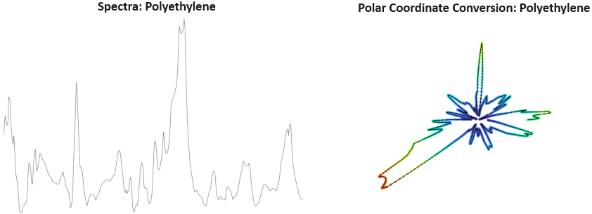

# Official repo for the paper GANsemble for Small and Imbalanced Data Sets: A Baseline for Synthetic Microplastics Data

## Abstract

Microplastic particle ingestion or inhalation by humans is a problem of growing concern. Unfortunately, current research methods that use machine learning to understand their potential harms are obstructed by a lack of available data. Deep learning techniques in particular are challenged by such domains in which only small or imbalanced data sets are available. Overcoming this challenge often involves oversampling underrepresented classes or augmenting the existing data to improve model performance. This paper proposes GANsemble: a two-module framework connecting data augmentation with conditional generative adversarial networks (cGANs) to generate class-conditioned synthetic data. First, the data chooser module automates augmentation strategy selection by searching for the best data augmentation strategy. Next, the cGAN module uses this strategy to train a cGAN for generating enhanced synthetic data. We experiment with the GANsemble framework on a small and imbalanced microplastics data set. A Microplastic-cGAN (MPcGAN) algorithm is introduced, and baselines for synthetic microplastics (SYMP) data are established in terms of Fréchet Inception Distance (FID) and Inception Scores (IS). We also provide a synthetic microplastics filter (SYMP-Filter) algorithm to increase the quality of generated SYMP. Additionally, we show the best amount of oversampling with augmentation to fix class imbalance in small microplastics data sets. To our knowledge, this study is the first application of generative AI to synthetically create microplastics data. 


## Notable Figures

### Figure 1: Polar Coordinate Conversion

### Figure 2: Qualitative Properties of Generated Microplastics

### Figure 3: Best Amount of Oversampling Search


## Project Structure

```bash
.
├── GANsemble
│   ├── .git
│   ├── MPcGAN.py
│   ├── README.md
│   ├── 📁 data_processing
│   ├── 📁 generator_weights
│   ├── 📁 info_data_chooser
│   ├── 📁 notebooks
│   ├── requirements.txt
│   └── 📁 utils
    └── imgs
        ├── fSYMPFilter.png
        ├── fconversion.png
        ├── fqualitative.png
        └── fsizesearch.png
```


## Installation

```bash
cGAN tf gpu requirements:
(simple) windows 11 through wsl and directml:
-https://learn.microsoft.com/en-us/windows/ai/directml/gpu-tensorflow-wsl follow instructions from link
-wsl
-latest nvidia driver
-conda
pip install -r requirements.txt
```

## Usage

```bash
python MPcGAN.py
```

# More Tutorial

GO TO: [GANsemble PlayGround](notebooks/playground.ipynb)

## Citation

```bash
@article{Platnick2024GANsemble,
	author = {Platnick, Daniel and Khanzadeh, Sourena and Sadeghian, Alireza and Valenzano, Richard},
	journal = {Proceedings of the Canadian Conference on Artificial Intelligence},
	year = {2024},
	month = {may 27},
	note = {https://caiac.pubpub.org/pub/0hhra7j6},
	publisher = {Canadian Artificial Intelligence Association (CAIAC)},
	title = {GANsemble for {Small} and {Imbalanced} {Data} {Sets}:A {Baseline} for {Synthetic} {Microplastics} {Data}},
}


```
